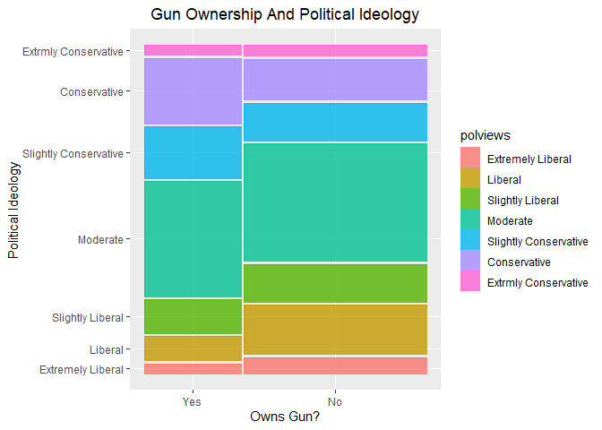
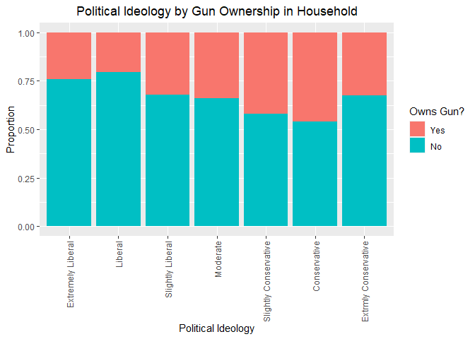

GSS Dataset: Statistical Inference
================

### Research Question

<blockquote>

<b>Does there appear to be a relationship between gun possession and
political ideology?</b>

</blockquote>

This question aims to explore whether there is any relation between
having a gun in home (gun here refers to any guns or revolvers) and the
respondent’s political ideology (i.e. Liberal, Moderate, or conservative
with various levels).</br> We find interest in this question because gun
ownership laws and regulation has always been a political debate. With
this study we can confirm if the act of owning a firearm is associated
with the political ideology.

-----

### About The Data

**Data Collection Method :**<br /> The General Social Survey has been
monitoring societal change and studying the growing complexity of
American society since 1972. Block quota sampling was used in 1972,
1973, and 1974 surveys and for half of the 1975 and 1976 surveys.Full
probability sampling was employed in half of the 1975 and 1976
surveys.The same sampling method was also employed from 1977 to 2018.

**Targeted Population:**<br /> Surveys from 1972 to 2004 targeted
English-speaking adult population, aged 18 years or older, living in
non-institutional arrangements within the United States. Starting in
2006 Spanish-speakers were added to the target population.

**Sample Used:**

The used Sample was collected in the year 2012, and consist of 1216
observations.

-----

## Load packages

``` r
library(ggplot2)
library(dplyr)
```

    ## Warning: package 'dplyr' was built under R version 4.0.3

``` r
library(statsr)
```

    ## Warning: package 'statsr' was built under R version 4.0.3

``` r
library(ggmosaic)
load("gss.Rdata")
```

-----

## Exploratory data analysis

``` r
#select and filter the data with null values
data <- gss %>%
  select(polviews, year, owngun) %>% 
  filter(!is.na(polviews),
         !is.na(owngun),
         owngun != "Refused",
         year == 2012)
data$owngun <- factor(data$owngun)

#print the number of observations
nrow(data)
```

    ## [1] 1216

``` r
#print the total proportions for gun owners
data %>%
  group_by(owngun) %>%
  summarize(total = n()) %>%
  mutate(proportion = total/sum(total))
```

    ## `summarise()` ungrouping output (override with `.groups` argument)

    ## # A tibble: 2 x 3
    ##   owngun total proportion
    ##   <fct>  <int>      <dbl>
    ## 1 Yes      420      0.345
    ## 2 No       796      0.655

``` r
#print a contingency table for the two variables
table(data$polviews, data$owngun)
```

    ##                        
    ##                         Yes  No
    ##   Extremely Liberal      13  41
    ##   Liberal                33 127
    ##   Slightly Liberal       46  97
    ##   Moderate              156 302
    ##   Slightly Conservative  70  97
    ##   Conservative           89 105
    ##   Extrmly Conservative   13  27

``` r
#visualize the contingency table with mosaic plot
ggplot(data) +
  geom_mosaic(aes(x= product(polviews, owngun), fill = polviews)) + 
  labs(title = "Gun Ownership And Political Ideology",
       x = "Owns Gun?",
       y = "Political Ideology")  +
  theme(plot.title = element_text(hjust = 0.5))
```

<!-- -->

The above mosaic plot visualizes all the summary statistics calculated
above, it shows the proportions for political ideology and gun
ownership. It appear that generally Moderate respondents comprises the
highest count in the sample, and extremely conservative respondents have
the highest count.

<br />

``` r
#show the proportion of gun owners for each political ideology
ggplot(data, aes(x = polviews, fill = owngun)) +
  geom_bar(position = "fill") +
  labs(title = "Political Ideology by Gun Ownership in Household",
       x = "Political Ideology",
       y = "Proportion",
       fill = "Owns Gun?") +
  theme(axis.text.x = element_text(angle = 90, hjust = 1, vjust = 0.5),
        plot.title = element_text(hjust = 0.5))
```

<!-- -->
<br /> The Above bar plot shows the proportion of gun owners for the
different political ideologies. It appears that conservatives and
slightly conservative have the highest proportions of gun possession,
while liberals have the lowest rate of gun possession in household.
<br />

-----

## Inference

**Hypotheses:**

 <i>H0: Gun possession and political ideology are independent. Gun
position rates do not vary by political ideology</i><br />  <i>HA: Gun
possession and political ideology are dependent. Gun possession rates do
vary by political ideology</i>

**Significance Level:**<br /> Significance level of α = 0.05 is used.

**Conditions:**<br />

<ol>

<li>

Independence:

</li>

<ul>

<li>

Observations are independent of each other. (this is mentioned data
collection section)

</li>

<li>

Random sampling was used (this is mentioned data collection section)

<li>

Sample size, n = 1216, n \< 10% of the population

</li>

<li>

Each case only contributes to one cell

</li>

</ul>

<li>

Sample size:

</li>

<ul>

<li>

Each cell has at least 5 expected cases

</li>

</ul>

</ol>

**Method used:**

Since, the variables used are of multiple levels the Chi-square test of
independence is used to conduct the inference. Chi-square test of
independence find the p-value by using the Chi-square statistic, and
degree of freedom. The expected values and degree of freedom are
obtained using following formula:<br />   <b>Expected count = (row
total) \* (column total)/ table total</b><br />   <b>Degree of freedom =
(number of rows – 1) \* (number of columns – 1)</b><br /> Using the
expected counts, the chi-square value is calculated which is then used
along with the degree of freedom to find the p-value.<br /> chisq.test()
function which is part of the stats package is used to carry out the
calculation by passing the contingency table as argument.

**Inference:**

``` r
# To make the contingency table a bit readable we change labels of plviews
levels(data$polviews) <- c("Extremely Lib",
                           "Liberal",
                           "Slightly Lib",
                           "Moderate",
                           "Slightly Con",
                           "Conservative",
                           "Extremely Con")

#create a contingency table for the variables 
count_tbl <- table(data$owngun, data$polviews)

#perform the test
chi_test <- chisq.test(count_tbl)
chi_test
```

    ## 
    ##  Pearson's Chi-squared test
    ## 
    ## data:  count_tbl
    ## X-squared = 31.84, df = 6, p-value = 1.751e-05

``` r
#Print the observed counts table
chi_test$observed
```

    ##      
    ##       Extremely Lib Liberal Slightly Lib Moderate Slightly Con Conservative
    ##   Yes            13      33           46      156           70           89
    ##   No             41     127           97      302           97          105
    ##      
    ##       Extremely Con
    ##   Yes            13
    ##   No             27

``` r
#Print the expected counts table
round(chi_test$expected)
```

    ##      
    ##       Extremely Lib Liberal Slightly Lib Moderate Slightly Con Conservative
    ##   Yes            19      55           49      158           58           67
    ##   No             35     105           94      300          109          127
    ##      
    ##       Extremely Con
    ##   Yes            14
    ##   No             26

``` r
#Print the p-value
chi_test$p.value
```

    ## [1] 1.751318e-05

**Interpretation:**<br /> At X-squared of 31.84 and 6 degrees of
freedom, the chi-square test of independence yields a p-value that is
almost zero.

**Inference:**<br /> <b>At 0.05 significance level and with a p-value ≈
0, we reject the null hypothesis in favor of the alternative.</b><br />
The data provide convincing evidence that political ideology and gun
possession are associated in the targeted population.<br /> Since this
is an observational study, no causality can be concluded.

**Remarks on Confidence Interval:**<br /> Chi-square test of
independence is used to conduct the inference, for which there is no
associated confidence interval. No confidence interval has been
calculated for the parameter of interest.
